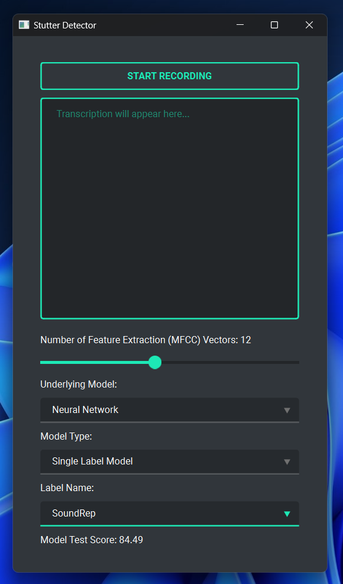
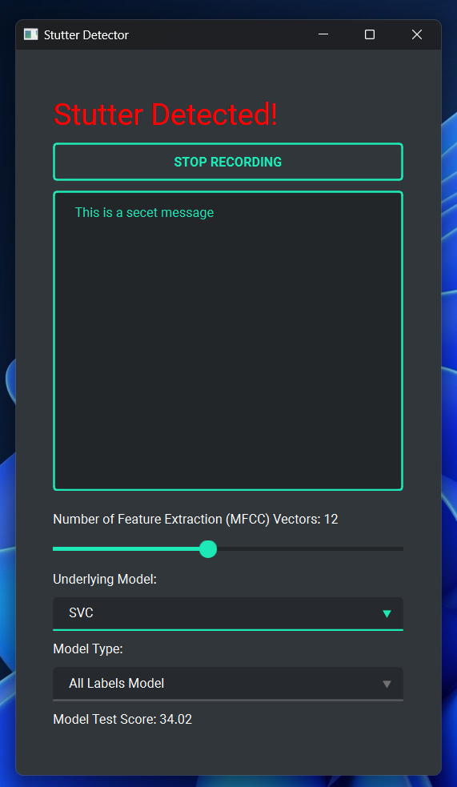

# Stutter Classification

<p align="left">
  
  
</p>


This project originally started as a fork of https://github.com/mitul-garg/stutter-classification. Now, it uses the same method of feature extraction and Sklearn model training, but in a modular structure that has been implemented into a GUI!

Due to its size, the SEP-28k clips are not included in this repo. To make the models work, all audio must be downloaded and all clips must be extracted into the `data/clips/` folder using the Python scripts provided in the [SEP-28k repository](https://github.com/apple/ml-stuttering-events-dataset).

MFCC-encoded vectors are also not included in this repo. When running a model for the first time, it will generate the vectors of size `n_mfccs` and save them in a file. This will take a while, but it will only happen once for each `n_mfccs` value.

To run the GUI:

1. Clone the repository:

    ```bash
    git clone https://github.com/benkoppe/stutter-classification
    ```

2. Download SEP-28k clips into the `data/clips` folder using the [SEP-28k repository](https://github.com/apple/ml-stuttering-events-dataset).

    ```bash
    python download_audio.py --episodes SEP-28k_episodes.csv --wavs [WAV_DIR]
    python extract_clips.py --labels SEP-28k_labels.csv --wavs [WAV_DIR] --clips [PROJECT_DIR]/data/clips
    ```

    Where `[PROJECT_DIR]` is the project's main directory that was created after cloning. `[PROJECT_DIR]/data` also currently contains the SEP-28k labels file. 
    
    See the repository for more information on downloading these files.

3. Download dependencies with [Poetry](https://python-poetry.org/):

    ```bash
    poetry install
    ```

    Installation instructions for Poetry can be found [here](https://python-poetry.org/docs/).

4. Run the GUI.

    First, `cd` into the project's gui directory:

    ```bash
    cd [PROJECT_DIR]/stutter_classification/gui
    ```

    Then, run the `app.py` file:

    ```bash
    python app.py
    ```

    This will run the GUI! Don't forget that running takes a while the first time as MFCC-encoded vectors are generated (a progress bar for this will be shown in the terminal), but it will only happen once.


## Jupyter Notebooks

The repository also contains two Jupyter notebooks in the `stutter_classification` folder: one to display how the MFCC dataset can be created with the module, and one to display how models can be quickly trained and scored with the module. 

These notebooks can be run after installing all dependencies with Poetry as shown above.